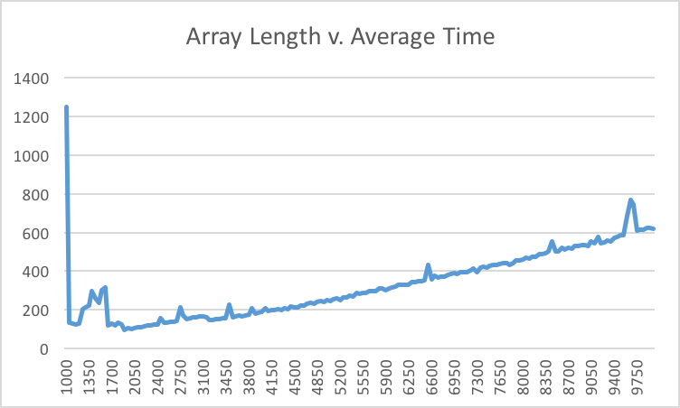

# StPatrick #
APCS2 pd02

L#01 -- What Does the Data Say?

Kathleen Wong, Susan Lin, Puneet Johal

## Hypothesis ##
The best case and average case for QuickSort is when the midpoint of the array
is used as the pivot point, which will run in O(nlogn). The worst case for QuickSort
is when the either end of the array is used as the pivot point, resulting in
O(n^2).

## Background ##
QuickSort.java should have a runtime of **O(n)**.

type in javac QuickSortTester.java

then type in java QuickSortDriver > data.csv

## Best Case ##
The best case scenario of the following QuickSort algorithm is if the pivot point that is chosen happens to be the middle value in the sorted array.

## Average or Most Likely Case ##
The most likely/average case scenario of the following QuickSort algorithm is the pivot point will be some point between the first and third quartiles of the sorted array.

## Worst Case ##
The worst case scenario of the following QuickSort algorithm is if the pivot point that is chosen happens to be one of the extreme values of the sorted array.

## Methodology ##
We first tested with various pivot points of rightmost, leftmost, and random positioning. With each of these, we varied the array size to show trend over a mass amount of data. 
## Results ##

The data shows that the runtime is roughly liner.

We were able to formulate a *line* of best fit, further showing that our results were linear.

## Conclusions ##
The function runs in linear time with negligible deviations.

The data indicates that there are less fluctuations the more times you have already ran the code.

## Conclusions ##
The sort algorithm runs in linear time.

The minor deviations were mostly likely caused by the randomness of the target number which could have led to either a worst or best case scenario.
