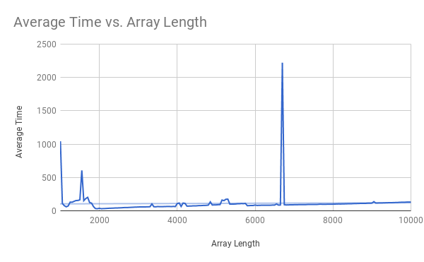

# StPatrick #
APCS2 pd02

L#01 -- What Does the Data Say?

Kathleen Wong, Susan Lin, Puneet Johal

## Hypothesis ##
The best case and average case for QuickSort is when the midpoint of the array
is used as the pivot point, which will run in O(nlogn). The worst case for QuickSort
is when the either end of the array is used as the pivot point, resulting in
O(n^2).

## Background ##
QuickSort is a sort that first partitions the arrary around a pivot point
and then recursively partitions each side of the pivot point.

## Best Case ##
The best case scenario of the following QuickSort algorithm is if the pivot point that is chosen happens to be the middle value in the sorted array.

## Average or Most Likely Case ##
The most likely/average case scenario of the following QuickSort algorithm is the pivot point will be some point between the first and third quartiles of the sorted array.

## Worst Case ##
The worst case scenario of the following QuickSort algorithm is if the pivot point that is chosen happens to be one of the extreme values of the sorted array.

## Methodology ##
We tested arrays that were already sorted in ascending or descending order, or a random array
by using the midpoint, the first element, the last element, and a random element as the pivot
point.

## Results ##
* Sorting a random array using the midpoint as the pivot point

* Sorting a sorted ascending array using the midpoint as the pivot point

* Sorting a sorted descending array using the midpoint as the pivot point

* Sorting a random array using the first element as the pivot point

* Sorting a sorted ascending array using the first element as the pivot point

* Sorting a sorted descending array using the first element as the pivot point

* Sorting a random array using the last element as the pivot point

* Sorting a sorted ascending array using the last element as the pivot point

* Sorting a sorted descending array using the last element as the pivot point

* Sorting a random array using a random element as the pivot point

* Sorting a sorted ascending array using a random element as the pivot point

* Sorting a sorted descending array using a random element as the pivot point

## Conclusions ##
The function runs in linear time with negligible deviations.

The data indicates that there are less fluctuations the more times you have already ran the code.
